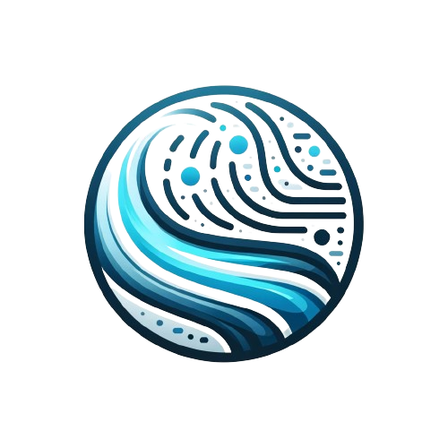

<a name="readme-top"></a>

<!-- PROJECT SHIELDS -->

<!-- PROJECT LOGO -->
<br />
<div align="center">
  <a href="https://github.com/thedjpetersen/flow-like-water">
    
  </a>

<h3 align="center">Flow like water 🤙</h3>

  <p align="center">
    Flow like water and move easily through states.
    <br />
    <a href="https://github.com/thedjpetersen/flow-like-water"><strong>Explore the docs »</strong></a>
    <br />
    <br />
    <a href="https://github.com/thedjpetersen/flow-like-water">View Demo</a>
    ·
    <a href="https://github.com/thedjpetersen/flow-like-water/issues">Report Bug</a>
    ·
    <a href="https://github.com/thedjpetersen/flow-like-water/issues">Request Feature</a>
  </p>
</div>

<!-- TABLE OF CONTENTS -->
<details>
  <summary>Table of Contents</summary>
  <ol>
    <li>
      <a href="#about-the-project">About The Project</a>
    </li>
    <li>
      <a href="#getting-started">Getting Started</a>
      <ul>
        <li><a href="#installation">Installation</a></li>
      </ul>
    </li>
    <li><a href="#api">API</a></li>
    <li><a href="#usage">Usage</a></li>
    <li><a href="#license">License</a></li>
    <li><a href="#contact">Contact</a></li>
    <li><a href="#acknowledgments">Acknowledgments</a></li>
  </ol>
</details>

<!-- ABOUT THE PROJECT -->

## About The Project

When working with many different states and transitions it can be difficult to keep track of everything as a pipeline. This library gives you a way to treat each chunk as a state and then define the transitions between them. You can also define conditions for each transition and even retry failed transitions.

In addition we can group tasks together and execute them collectively. This allows us to manage the execution of multiple tasks and even other task groups.

<p align="right">(<a href="#readme-top">back to top</a>)</p>

<!-- GETTING STARTED -->

## Getting Started

To get setup we just need to install the library locally and then we can start defining
our states and transitions.

### Installation

```sh
npm install flow-like-water
```

<p align="right">(<a href="#readme-top">back to top</a>)</p>

## API

### `Task` Class API

| Method      | Arguments                                                                                                                                                                            | Description                                                                                                                                                                     |
| ----------- | ------------------------------------------------------------------------------------------------------------------------------------------------------------------------------------ | ------------------------------------------------------------------------------------------------------------------------------------------------------------------------------- |
| Constructor | `options: { id: TaskId; execute: () => Promise<void \| TaskId \| TaskGroupId>; checkCondition: () => Promise<boolean>; nextTasks?: TaskId[]; retries?: number; waitTime?: number; }` | Initializes a new `Task` instance with specified options.                                                                                                                       |
| runTask     | -                                                                                                                                                                                    | Executes the task, managing its state and execution time. Returns a promise with the result. Throws an error if the execution fails or the post-execution condition is not met. |
| run         | -                                                                                                                                                                                    | Executes the task with retry logic. If the task fails, it retries the execution based on the specified retries and wait time.                                                   |

### `TaskGroup` Class API

| Method      | Arguments                       | Description                                                         |
| ----------- | ------------------------------- | ------------------------------------------------------------------- |
| Constructor | `id: TaskGroupId`               | Constructs a new instance of `TaskGroup` with a unique identifier.  |
| addChild    | `task: Task \| TaskGroup`       | Adds a task or task group to the collection.                        |
| removeChild | `taskId: TaskId \| TaskGroupId` | Removes a task or task group from the collection by its identifier. |

### `FlowControl` Class API

| Method             | Arguments                  | Description                                                       |
| ------------------ | -------------------------- | ----------------------------------------------------------------- |
| Constructor        | -                          | Initializes a new `FlowControl` instance.                         |
| addGroup           | `taskGroup: TaskGroup`     | Adds a task group to the collection.                              |
| removeGroup        | `taskGroupId: TaskGroupId` | Removes a task group from the collection using its ID.            |
| getTaskGroups      | -                          | Retrieves all task groups in the collection.                      |
| getTaskGroup       | `taskGroupId: TaskGroupId` | Retrieves a specific task group by its ID.                        |
| run                | -                          | Executes all task groups managed by the FlowControl instance.     |
| getSerializedState | -                          | Serializes the state of all task groups into a structured format. |

<p align="right">(<a href="#readme-top">back to top</a>)</p>

## Usage

Use this space to show useful examples of how a project can be used. Additional screenshots, code examples and demos work well in this space. You may also link to more resources.

_For a full usage example please checkout the example listed in the [examples directory](https://github.com/thedjpetersen/flow-like-water/tree/main/examples)_

```typescript
// Import the necessary classes from the library
import { Task, TaskGroup, FlowControl } from "./your-library-path";

/*
 * Example Task Execution Logic
 *
 * This function simulates a task. Replace it with your actual task logic.
 * For instance, this could be a network request, file operation, etc.
 */
async function sampleTaskExecution() {
  console.log("Executing sample task...");
  // Add your task logic here
}

/*
 * Example Condition Check
 *
 * This function simulates checking a condition before executing a task.
 * Replace it with your actual condition logic.
 * For example, checking if a file exists before trying to read it.
 */
async function sampleConditionCheck() {
  console.log("Checking condition for task execution...");
  // Add your condition logic here
  return true; // Return true if the condition is met, false otherwise
}

// Create a new task instance
// This task will use the sample execution logic and condition check defined above
const task1 = new Task({
  id: "task1",
  execute: sampleTaskExecution,
  checkCondition: sampleConditionCheck,
  retries: 2, // Number of retries if the task fails
  waitTime: 1500, // Waiting time in milliseconds before each retry
});

// You can define more tasks similar to task1
// For simplicity, we're reusing the same task logic and condition for task2
const task2 = new Task({
  id: "task2",
  execute: sampleTaskExecution,
  checkCondition: sampleConditionCheck,
  retries: 1,
  waitTime: 1000,
});

// Create a task group and assign an identifier to it
// Task groups can contain multiple tasks and even other task groups
const group = new TaskGroup("group1");

// Add tasks to the group
// Tasks are managed within the group and can be executed collectively
group.addChild(task1);
group.addChild(task2);

// Create an instance of FlowControl
// FlowControl is used to manage and execute task groups
const flowControl = new FlowControl();

// Add the group to the FlowControl
// This allows the FlowControl to manage the execution of this group
flowControl.addGroup(group);

flowControl.on("taskStarted", (task) => {
  console.log(`Task ${task.id} has started.`);
});

flowControl.on("taskCompleted", (task) => {
  console.log(`Task ${task.id} has completed.`);
});

// Execute all task groups managed by the FlowControl instance
// This will run all tasks in 'group1', handling retries and condition checks
flowControl
  .run()
  .then(() => {
    console.log("All tasks in all groups have been executed successfully.");
  })
  .catch((error) => {
    console.error("An error occurred during task group execution:", error);
  });
```

<p align="right">(<a href="#readme-top">back to top</a>)</p>

<!-- CONTRIBUTING -->

## Contributing

Contributions are what make the open source community such an amazing place to learn, inspire, and create. Any contributions you make are **greatly appreciated**.

If you have a suggestion that would make this better, please fork the repo and create a pull request. You can also simply open an issue with the tag "enhancement".
Don't forget to give the project a star! Thanks again!

1. Fork the Project
2. Create your Feature Branch (`git checkout -b feature/AmazingFeature`)
3. Commit your Changes (`git commit -m 'Add some AmazingFeature'`)
4. Push to the Branch (`git push origin feature/AmazingFeature`)
5. Open a Pull Request

<p align="right">(<a href="#readme-top">back to top</a>)</p>

<!-- LICENSE -->

## License

Distributed under the MIT License. See `LICENSE.txt` for more information.

<p align="right">(<a href="#readme-top">back to top</a>)</p>

<!-- CONTACT -->

## Contact

DJ Petersen - [@thedjpetersen](https://twitter.com/thedjpetersen)

Project Link: [https://github.com/thedjpetersen/flow-like-water](https://github.com/thedjpetersen/flow-like-water)

<p align="right">(<a href="#readme-top">back to top</a>)</p>

<!-- ACKNOWLEDGMENTS -->

## Acknowledgments

- [ChatGPT](https://chat.openai.com/c/894827ae-a7f8-4de6-82a7-549c067f5a30)

<p align="right">(<a href="#readme-top">back to top</a>)</p>

<!-- MARKDOWN LINKS & IMAGES -->
<!-- https://www.markdownguide.org/basic-syntax/#reference-style-links -->

[contributors-shield]: https://img.shields.io/github/contributors/github_username/repo_name.svg?style=for-the-badge
[contributors-url]: https://github.com/github_username/repo_name/graphs/contributors
[forks-shield]: https://img.shields.io/github/forks/github_username/repo_name.svg?style=for-the-badge
[forks-url]: https://github.com/github_username/repo_name/network/members
[stars-shield]: https://img.shields.io/github/stars/github_username/repo_name.svg?style=for-the-badge
[stars-url]: https://github.com/github_username/repo_name/stargazers
[issues-shield]: https://img.shields.io/github/issues/github_username/repo_name.svg?style=for-the-badge
[issues-url]: https://github.com/github_username/repo_name/issues
[license-shield]: https://img.shields.io/github/license/github_username/repo_name.svg?style=for-the-badge
[license-url]: https://github.com/github_username/repo_name/blob/master/LICENSE.txt
[linkedin-shield]: https://img.shields.io/badge/-LinkedIn-black.svg?style=for-the-badge&logo=linkedin&colorB=555
[linkedin-url]: https://linkedin.com/in/linkedin_username
[product-screenshot]: images/screenshot.png
[Next.js]: https://img.shields.io/badge/next.js-000000?style=for-the-badge&logo=nextdotjs&logoColor=white
[Next-url]: https://nextjs.org/
[React.js]: https://img.shields.io/badge/React-20232A?style=for-the-badge&logo=react&logoColor=61DAFB
[React-url]: https://reactjs.org/
[Vue.js]: https://img.shields.io/badge/Vue.js-35495E?style=for-the-badge&logo=vuedotjs&logoColor=4FC08D
[Vue-url]: https://vuejs.org/
[Angular.io]: https://img.shields.io/badge/Angular-DD0031?style=for-the-badge&logo=angular&logoColor=white
[Angular-url]: https://angular.io/
[Svelte.dev]: https://img.shields.io/badge/Svelte-4A4A55?style=for-the-badge&logo=svelte&logoColor=FF3E00
[Svelte-url]: https://svelte.dev/
[Laravel.com]: https://img.shields.io/badge/Laravel-FF2D20?style=for-the-badge&logo=laravel&logoColor=white
[Laravel-url]: https://laravel.com
[Bootstrap.com]: https://img.shields.io/badge/Bootstrap-563D7C?style=for-the-badge&logo=bootstrap&logoColor=white
[Bootstrap-url]: https://getbootstrap.com
[JQuery.com]: https://img.shields.io/badge/jQuery-0769AD?style=for-the-badge&logo=jquery&logoColor=white
[JQuery-url]: https://jquery.com
